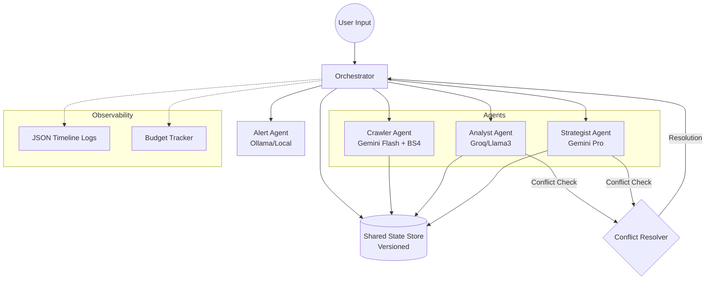

# System Design: The Swarm Architecture

## High-Level Overview
The system follows an **Orchestrated Swarm** pattern. Unlike autonomous agents that loop indefinitely, this system uses a central **Orchestrator** to enforce budgets, timeouts, and structured state transitions.

## Architecture Diagram

## Key Components

### 1. Messaging (messaging/schemas.py)
Uses Pydantic V2 for strict type enforcement.
- **Message Types**: REQUEST, RESPONSE, ESCALATION, VETO, APPROVAL, REVISION_NEEDED.
- **Roles**: ORCHESTRATOR, CRAWLER, ANALYST, STRATEGIST, ALERTER.

### 2. State Management (state/state_manager.py)
Centralized "Source of Truth" with versioning.
- Every state mutation is attributed to an agent.
- Audit trail for every change.

### 3. Orchestration (orchestrator/orchestrator.py)
The control plane that manages:
- **Budgeting**: Stop execution if cost > $0.50.
- **Timeouts**: Intervene if an agent stalls for > 60s.
- **Conflict Resolution**: Logical arbitration when agents disagree.
