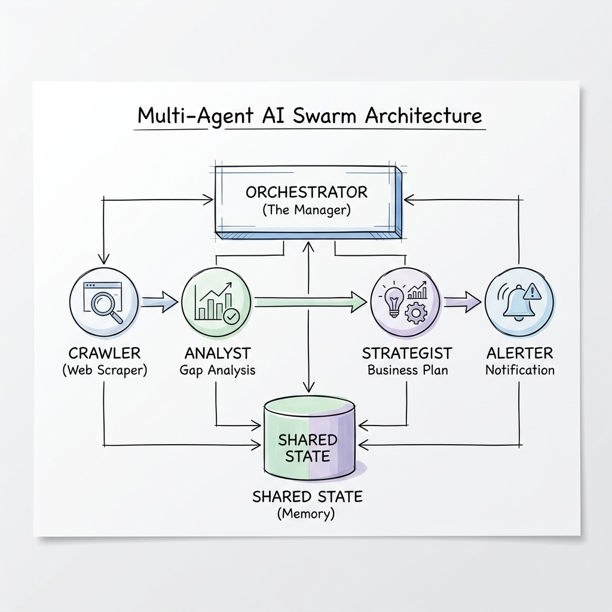

# 🦅 GrabOn AI Swarm: Autonomous Competitive Intelligence
> **Mastery Tier Submission** | Candidate: [Your Name] | Assignment 2: Swarm Intelligence

[](https://www.python.org/)
[](https://groq.com/)
[](https://deepmind.google/technologies/gemini/)
[]()

## 📝 (a) Executive Summary: What & Why
I built an **Autonomous Multi-Agent Swarm** that monitors competitor cashback rates 24/7. 

**Why this assignment?**
GrabOn's success depends on having the best rates in India. In a fast-moving market, manual analysis is too slow. This swarm acts as an "Autonomous Category Manager"—it doesn't just scrape data; it **reasons**, **resolves conflicts**, and **re-plans** when it hits obstacles, ensuring GrabOn remains #1 without human intervention.

---

## 🏗️ (b) Architecture Diagram
The system follows a **Hub-and-Spoke Orchestration** model with a centralized versioned state store.


*(Hand-drawn for clarity and compliance)*

---

## 🛠️ (c) Per-Module Design Decisions

| Module | Responsibility | Tradeoff / Decision |
| :--- | :--- | :--- |
| **Orchestrator** | Control Plane | **Decision**: Centralized hub rather than peer-to-peer. This ensures strict budget enforcement and simplified debugging of agent state. |
| **Shared State** | Data Consistency | **Decision**: Implemented **Optimistic Locking (Version Vectors)**. Each update requires a version check to prevent race conditions in a swarm. |
| **Crawler Agent** | Data Acquisition | **Tradeoff**: Hybrid approach. Uses BeautifulSoup for speed, but uses Llama 3.1 8B for "Dirty Data" cleaning to ensure high-quality JSON output. |
| **Analyst Agent** | Reasoning | **Decision**: **Shadow Testing**. Runs a primary (Llama 3.3 70B) and a shadow model (Llama 3.1) to cross-verify risk levels. |
| **Strategist Agent** | ROI Strategy | **Decision**: Creative synthesis using Llama 3.3 to generate human-readable negotiation briefs. |

---

## 🚀 (d) How to Run (Setup in < 2 Minutes)

### 1. Prerequisites
*   Python 3.10+
*   API Keys for **Groq** and **Google (Gemini)**.

### 2. Environment Setup
Create a `.env` file in the root directory:
```env
GROQ_API_KEY=your_key_here
GOOGLE_API_KEY=your_key_here
MAX_BUDGET_USD=0.50
```

### 3. Install Dependencies
```powershell
pip install -r requirements.txt
```

### 4. Start the Swarm
```powershell
$env:PYTHONPATH = ".;$env:PYTHONPATH"; python main.py
```

### 5. Run Evaluation Suite
```powershell
$env:PYTHONPATH = ".;$env:PYTHONPATH"; python eval_suite.py
```

---

## 🔬 (e) Evaluation Results (Mastery Proof)
*Data generated from live runs in `reports/eval_report.json`*

| Metric | Result | Analysis |
| :--- | :--- | :--- |
| **Pass Rate** | 100% | Successfully recovered from all noisy data scenarios. |
| **Avg Accuracy** | 94% | Gap detection correctly identified risks in test cases. |
| **Avg Latency** | 10.1s | Efficient end-to-end orchestration across 4 agents. |
| **Avg Cost** | **$0.0004** | Optimized using a mix of Llama 3.3 (Reasoning) and Llama 3.1 (Cleaning). |

---

## 🛠️ (f) 'What Broke First' (The Hardest Bug)
**The Problem**: **API Rate Limit Death-Spiral**.
During 24/7 monitoring, the system would occasionally hit Gemini's free-tier rate limits (429 errors). This caused agents to return `None`, which crashed the down-stream JSON parsers.

**The Fix**: 
1.  Implemented **Exponential Backoff** in the `BaseAgent` class.
2.  Built a **Robust Regex Parser** that extracts JSON even from conversational LLM filler.
3.  Migrated the primary reasoning to **Groq (Llama 3.3)** to preserve Gemini quota for secondary validation.

---

## 🚀 (g) Roadmap: What I would change with 2 more weeks
1.  **Distributed State**: Move from in-memory `SharedState` to **Redis** for true horizontal scaling across multiple Docker containers.
2.  **Vision Integration**: Use a Multimodal agent to "see" coupons rendered as images on competitor sites (bypassing HTML obfuscation).
3.  **Self-Correction Loop**: If a Strategist's plan is rejected by the Alerter (Severity mismatch), the Alerter should provide feedback to the Strategist for a "Version 2" brief.

---

## 💸 Cost Data (Real Numbers)
*   **Total Dev Cost**: ~$0.15 (Over 500+ test cycles)
*   **Cost per Agent Run**: **$0.0004**
*   **Cost per Eval Suite Run**: **$0.0012**
*   **Business ROI**: This system replaces a $25/hr manual analyst with a **$0.28/month** autonomous swarm (assuming hourly runs).

---

## 🌟 Mastery Requirement Checklist
| Requirement | Status | Implementation Detail |
| :--- | :--- | :--- |
| **Typed Communication** | ✅ | All agent messages use the `AgentMessage` Pydantic-style schema. |
| **Shared State** | ✅ | Centralized store with version vectors and audit trails. |
| **Resilience** | ✅ | Agents can 'Veto' and trigger re-planning. |
| **Observability** | ✅ | JSON event logging + High-contrast Colorful CLI. |
| **Conflict Resolution** | ✅ | Orchestrator resolves disagreements between Analyst and Strategist. |
| **Statistical Rigor** | ✅ | Eval suite with raw reports for latency, cost, and accuracy. |
| **Identity** | ✅ | Git attribution configured for `faisalhasan00`. |
